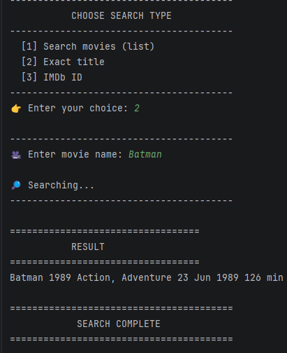

# 🎬 Movie Search CLI (Java)

A simple command-line application built in Java that consumes the OMDb API to search for movies, show details, and explore results interactively.

---

## 🚀 Features

- 🔍 Search movies (list results)
- 🎯 Search exact movie by title
- 🆔 Search by IMDb ID
- 📡 Integration with OMDb API
- 💻 Clean CLI interface

---

## 🧠 What I practiced

- Java HTTP Client (HttpClient)
- Working with REST APIs
- JSON parsing with Gson
- Object mapping (DTOs)
- CLI design and user interaction
- Control flow and input validation

---

## 🛠️ Tech Stack

- Java 17+
- Gson
- OMDb API
- Java HttpClient

---

## 📸 Example

